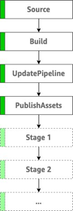

# Welcome to your CDK TypeScript project!

This is a blank project for TypeScript development with CDK.

The `cdk.json` file tells the CDK Toolkit how to execute your app.

## Useful commands

 * `npm run build`   compile typescript to js
 * `npm run watch`   watch for changes and compile
 * `npm run test`    perform the jest unit tests
 * `cdk deploy`      deploy this stack to your default AWS account/region
 * `cdk diff`        compare deployed stack with current state
 * `cdk synth`       emits the synthesized CloudFormation template


The following diagram illustrates the stages of a CDK pipeline.



- Source  – This stage is probably familiar. It fetches the source of your CDK app from your forked GitHub repo and triggers the pipeline every time you push new commits to it.

- Build – This stage compiles your code (if necessary) and performs a cdk synth. The output of that step is a cloud assembly, which is used to perform all actions in the rest of the pipeline.

- UpdatePipeline – This stage modifies the pipeline if necessary. For example, if you update your code to add a new deployment stage to the pipeline or add a new asset to your application, the pipeline is automatically updated to reflect the changes you made.

- PublishAssets – This stage prepares and publishes all file assets you are using in your app to Amazon Simple Storage Service (Amazon S3) and all Docker images to Amazon Elastic Container Registry (Amazon ECR) in every account and Region from which it’s consumed, so that they can be used during the subsequent deployments.


# How to run

1. Create `export-variables` file with `export-variables.example` file content in `script` directory && change some params

2. Create `.env` file with `.env.example` file content in `root` directory && change some params

3. set local param in current windows

    ```properties
    $ source ./script/export-variables
    ```

4. Create SSM Param in AWS

    ```properties
    $ bash ssm-put-parameters.sh
    ```

5. Install the Package

    ```properties
    $ npm i
    ```

6. List all Stacks

    ```properties
    $ cdk ls
    ```

7. Deploy to AWS

    ```properties
    $ cdk deploy CDKPipeline-Lambda-Dev-PipelineStack
    ```

> ***After the Stack has been deployed, the pipeline `Assets` Stage will be `fail` when the first time to deploy, then you need to manually create a `ECR` Registry. Realease change the pipeline after you manually create a `ECR` Registry.